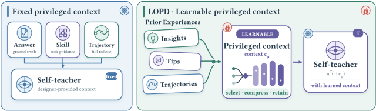
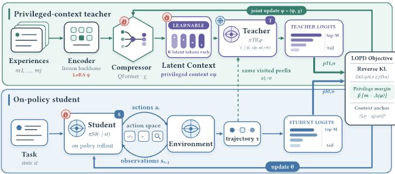
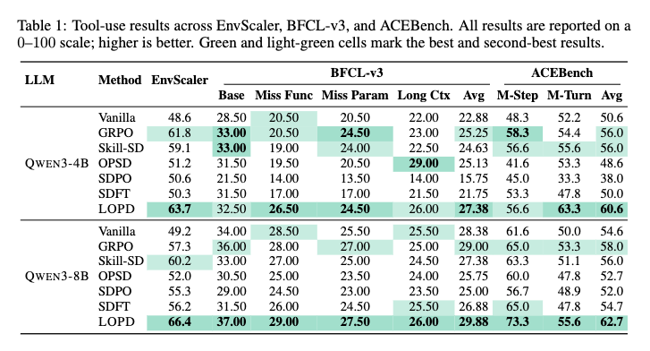
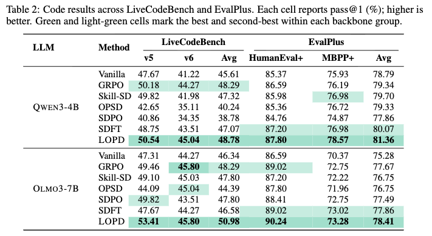
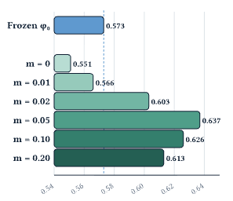
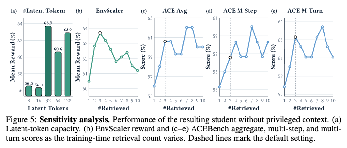
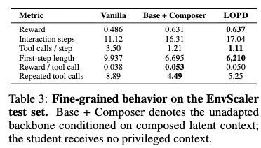

# 潜在同策略蒸馏

*Latent On-Policy Self-Distillation（LOPD）论文解读*

> 作者单位  新加坡国立大学、北京邮电大学、上海交通大学
> 代码仓库  https://github.com/bingreeky/LOPD
> 论文地址  https://arxiv.org/abs/2608.13040

## 摘要

让智能体从经验中学习，并把经验内化进自身策略，已经成为自进化人工智能的核心问题。同策略自蒸馏（OPSD）给出了一条有效路径。它的教师与学生来自同一模型，教师额外掌握特权信息，在学生自己生成的轨迹上提供稠密监督。然而，现有方法使用的特权信息仍由设计者事先规定，例如答案、反馈、技能或轨迹，这限制了持续自我改进所需要的端到端可学习性和可扩展性。本文提出潜在同策略自蒸馏（LOPD），让教师的特权上下文本身可以从经验中端到端学习，不再由人工规定新的上下文形式。具体做法是，LOPD检索相关经验，把它们组合成连续潜在token，作为教师的条件输入。学生仍根据任务和交互历史生成轨迹，并在每个实际访问过的前缀上接受稠密的token级监督。本文还提出特权间隔目标，用来稳定并约束潜在上下文的学习。实验上，LOPD在智能体工具调用和代码生成任务上超过了RLVR，也超过了OPSD、SDPO和Skill-SD等代表性OPSD方法；在不到GRPO和Skill-SD三成的rollout预算下，它就超过了二者。消融研究进一步直接证明，让特权上下文可学习是取得这些提升的必要条件。综合来看，LOPD朝着更具可扩展性和自主性的智能体演进范式迈出了一步。

## OPD与OPSD

OPD先让学生采样自己的轨迹，教师随后在学生实际访问的状态上给出token级分布。它减少了异策略模仿带来的训练与推理错位，也把RLVR稀疏的结果奖励细化成逐token监督。

OPSD进一步去掉独立的外部教师。教师和学生来自同一模型，学生只读取任务与交互历史，教师额外获得经过验证的推理信息或成功经验。这个信息差让教师分布比学生的更有信息量，也把研究问题推到了特权上下文本身。研究者需要决定教师该看到什么，以及这些信息能否在学生看不到它们的情况下被内化。

## 固定特权上下文的问题

已有方法给教师提供的上下文，无论经过验证的答案与推理轨迹、环境反馈，还是同批次的成功rollout，都是人工设计或按规则从经验中提取的形式。设计者在训练前就决定了教师该看什么。这些形式可以有用，但也把蒸馏限制在选定的格式里，教师无法自己学习哪些经验对监督学生当前的轨迹真正有用。

论文因此追问，**特权上下文能否直接从经验中学习**，让训练过程决定哪些证据值得保留，又该怎样编码这些证据。

## LOPD潜在同策略自蒸馏

LOPD把特权上下文写成可学习的连续表示。检索器先按当前任务取回历史经验，组合器再用编码器和QFormer式压缩器把它们压成潜在token。教师读取这些token，学生仍然只读取部署时能够获得的任务与交互历史。

潜在上下文可以接收梯度，蒸馏学生的同一过程也在训练组合器。只用蒸馏损失会让教师分布塌向学生，特权间隔约束用环境奖励检验教师优势，上下文锚定项则限制潜在表示偏离冷启动位置。

训练结束后只保留学生模型。经验库、检索器和组合器都不会进入推理流程，潜在上下文提供的指导已经被写进学生策略。

> 图1 左侧的OPSD由设计者规定教师看到的上下文，右侧的LOPD从历史经验中学习连续潜在token。

## LOPD原理

> 图2 LOPD训练流程。学生先采样自己的轨迹，组合器随后把检索经验压缩成潜在上下文，教师再在相同前缀上给出分布监督。反向KL负责分布蒸馏，特权间隔与上下文锚定项用于稳定组合器。

**学生先按当前策略完成任务，教师带着历史经验压缩出的潜在上下文，重新查看学生真正走过的生成前缀**。教师在这些前缀上给出token级分布监督，学生和组合器随后一起更新。这就是LOPD的主线。

### 学生先走自己的轨迹

多轮智能体在第$t$轮看到任务$x$、截至当前的环境观测$o_{\le t}$和之前的动作$a_{<t}$。学生据此采样新动作，逐步形成轨迹$\tau$。

$$
s_t=(x,o_{\le t},a_{<t}),\qquad
a_t\sim\pi_\theta^S(\cdot\mid s_t),\qquad
\tau\sim\pi_\theta^S(\cdot\mid x).
$$

**同策略**的含义就在这里。训练轨迹由当前学生亲自生成，教师只重新评估这些真正被访问过的状态。

### 经验先压缩，再交给教师

作者在离线阶段保存成功rollout。每条经验包含任务描述以及精简后的动作和结果，略去了冗长的观测。当新任务$x$到来时，稠密检索器按余弦相似度取回$J$条相关经验$\mathcal E=\{m_j\}_{j=1}^{J}$。检索器先缩小可参考的经验范围，组合器再决定每条经验中哪些信息适合交给教师。

组合器先把第$j$条经验编码成隐藏状态$H_j$，再由QFormer式压缩器生成$K$个潜在token。

$$
H_j=\operatorname{Enc}_{\psi}(x,m_j),\qquad
E_j=\operatorname{Comp}_{\chi}(H_j;Q_\chi)
=[\langle e_{j,1}\rangle,\ldots,\langle e_{j,K}\rangle].
$$

隐藏状态是编码器读取文本后产生的向量表示。它们保留了文本中的语义和结构信息，但无法像原文一样直接阅读。$Q_\chi$是$K$个可学习的查询向量，它们通过交叉注意力从$H_j$中读取信息，得到每条经验的定长表示$E_j$。

原始轨迹长短不一，也带有当前任务未必需要的细节。压缩器将每条经验变成固定数量的潜在token，从而控制教师上下文的长度。各组潜在token拼接后形成特权上下文

$$
c_\phi(x,\mathcal E)
=\bigoplus_{j=1}^{J}E_j,
\qquad \phi=(\psi,\chi).
$$

编码器主干保持冻结，可训练部分是编码器LoRA $\psi$与压缩器参数$\chi$。联合训练开始前，作者先用成功轨迹冷启动组合器，得到初始参数$\phi_0$。**潜在token只给教师看，学生始终只读取$s_t$。**

### 教师重看同一批前缀

教师是一份与学生同起点的冻结参考模型。在第$t$轮的第$n$个token位置，学生只看交互状态和动作前缀，教师额外看到$c_\phi$。

$$
p^S_{t,n}=\pi^S_\theta(\cdot\mid s_t,a_{t,<n}),\qquad
p^T_{t,n}=\pi^T_{\bar\theta,\phi}
(\cdot\mid s_t,c_\phi,a_{t,<n}).
$$

师生都在相同的$s_t$和$a_{t,<n}$上计算分布，教师在输入侧额外读取$c_\phi$。这样，每个教师目标都直接对应学生真正访问过的生成前缀，蒸馏监督无需转到教师单独生成的另一条轨迹上。

学生参数$\theta$在训练中持续更新，教师主干$\bar\theta$则保持冻结，两者在训练开始后会逐渐不同。教师的输入$c_\phi$也会随组合器而变化。前向计算保留了对$c_\phi$的梯度，蒸馏损失便可以穿过冻结教师回传到组合器。

完整词表上的分布蒸馏开销很大。LOPD保留教师概率最高的$M$个token，把剩余token的总概率收进一个尾部桶。学生和教师使用同一组top-$M$ token，处理后的两个分布分别记为$\widetilde p^S_{t,n}$与$\widetilde p^T_{t,n}$。

蒸馏损失对学生轨迹上所有需要监督的token取平均。

$$
\mathcal L_{\mathrm{distill}}(\theta,\phi)
=
\mathbb E_{x\sim\mathcal D,\,\tau\sim\pi_\theta^S(\cdot\mid x)}
\left[
\frac{
\displaystyle\sum_{t,n}\omega_{t,n}
D_{\mathrm{KL}}\!\left(
\widetilde p^S_{t,n}
\middle\Vert
\widetilde p^T_{t,n}
\right)
}{
\displaystyle\sum_{t,n}\omega_{t,n}
}
\right].
$$

$\mathcal D$是任务分布，$\omega_{t,n}\in\{0,1\}$是动作token掩码，只让需要监督的位置进入损失。**这里使用反向KL，所以学生分布在前，教师分布在后。**它会把学生的概率集中到教师支持的行为上，梯度也会经过$c_\phi$训练组合器。

### 特权间隔防止教师退化

组合器和学生联合训练会带来一个风险。组合器可以让$p^T$逐渐靠近$p^S$，蒸馏损失随之降低，教师却没有提供更多有效信息。**特权间隔要求教师保持一个能被任务结果验证的优势。**

论文先比较教师与学生对实际采样token $a_{t,n}$给出的对数概率，再用环境奖励$r(\tau)\in[0,1]$判断这个概率差是否有用。

$$
\delta_{t,n}(\phi)
=
\log p^T_{t,n}(a_{t,n})
-
\operatorname{sg}\!\left[\log p^S_{t,n}(a_{t,n})\right],
\qquad A(\tau)=2r(\tau)-1\in[-1,1].
$$

$\delta_{t,n}>0$表示教师给该token的概率高于学生，$\delta_{t,n}<0$则表示教师更不支持该token。$\operatorname{sg}$阻断这一项对学生的梯度，特权间隔因此只训练组合器。

将$A(\tau)$与$\delta_{t,n}$相乘，可以把token级概率差与整条轨迹的结果联系起来。成功轨迹的$A(\tau)$为正，教师更支持其中的token时，乘积也为正。失败轨迹的$A(\tau)$为负，教师降低对对应token的支持时，负负得正。论文将这些乘积汇总成平均特权值

$$
\Delta(\phi)
=
\mathbb E_\tau
\left[
\frac{
\displaystyle\sum_{t,n}\omega_{t,n}A(\tau)\delta_{t,n}(\phi)
}{
\displaystyle\sum_{t,n}\omega_{t,n}
}
\right].
$$

最后，作者加入上下文锚定项，把学到的$c_\phi$限制在冷启动表示$c_{\phi_0}$附近，防止联合训练过度改动已经学好的经验表示。完整训练目标写为

$$
\min_{\theta,\phi}\max_{\beta\ge0}
\quad
\mathcal L_{\mathrm{distill}}(\theta,\phi)
+
\beta\bigl(m-\Delta(\phi)\bigr)
+
\lambda
\left\|
c_\phi-\operatorname{sg}[c_{\phi_0}]
\right\|_2^2.
$$

**反向KL**训练学生和组合器。**特权间隔**要求$\Delta\geq m$，当条件未满足时，对偶变量按$\beta\leftarrow[\beta+\eta_\beta(m-\Delta)]_+$增大惩罚。**上下文锚定项**限制$c_\phi$过度偏离冷启动表示$c_{\phi_0}$。

> **训练时**学生先采样轨迹并获得环境奖励。组合器把检索经验压缩成潜在上下文，教师再在同一批前缀上给出分布监督。反向KL更新学生和组合器，对偶变量同步维持特权间隔。
>
> **推理时**只保留学生策略$\pi_\theta^S$。经验库、检索器和组合器都会移除，运行成本不会因潜在上下文而增加。

## 实验

### 实验设置

| 项目 | 设置 |
| --- | --- |
| 训练任务 | 智能体工具调用与代码生成 |
| 训练数据 | 2349条EnvScaler工具交互任务，以及DeepCoder中的TACO子集，其中含7000道已验证的Python题目 |
| 模型主干 | Qwen3-4B、Qwen3-8B、OLMo3-7B |
| 工具评测 | 留出的200条EnvScaler任务、BFCL-v3、ACEBench |
| 代码评测 | LiveCodeBench v5和v6、HumanEval+、MBPP+ |
| 对比方法 | Vanilla、GRPO、SDFT，以及OPSD、SDPO和Skill-SD |
| LOPD配置 | 检索数$J=3$，每条经验含$K=32$个潜在token，总计96个；$M=20$，$m=0.05$ |
| 生成预算 | 工具调用最多30个环境步，代码回复最多16384个token |

同一设置下，所有可训练方法使用相同的主干、训练数据划分和评测流程。解码温度与top-$p$保持一致，各基线沿用原论文规定的KL方向和损失形式。比较中的主要差别落在特权上下文的构造方式与蒸馏损失上。

### 实验结果

> 表1 EnvScaler、BFCL-v3与ACEBench上的工具调用结果。

> 表2 LiveCodeBench与EvalPlus上的pass@1结果。

**LOPD在十组模型与基准组合上都取得了最高的汇总成绩**。在Qwen3-4B上，LOPD的EnvScaler得分为63.7，最强基线为61.8。BFCL-v3上的最强基线为25.25，LOPD达到27.38；ACEBench上的最强基线为56.0，LOPD达到60.6。换成Qwen3-8B以后，LOPD在三项评测上达到66.4、29.88和62.7，对应的最强基线为60.2、29.00和58.0。

代码任务延续了这个趋势。Qwen3-4B上的LiveCodeBench与EvalPlus汇总成绩为48.78和81.36。OLMo3-7B上的成绩为50.98和78.41，分别领先最强替代方法2.69分与0.55分。

固定特权上下文的表现并不稳定。以Qwen3-4B为例，SDPO把BFCL-v3汇总成绩从Vanilla的22.88降到15.75，LiveCodeBench也从45.61降到38.78。OPSD能把BFCL-v3长上下文子集从22.00提高到29.00，却在LiveCodeBench上降到40.24。可见特权信息有没有用，取决于它是否适合当前任务和学生所处的前缀。LOPD把这种匹配交给训练过程学习，它在全部十组汇总比较中都高于Vanilla，提升范围为1.50分到17.2分。

训练曲线也给出了样本效率方面的证据。LOPD在320次同策略生成后超过0.61平均奖励，第576次生成时达到0.637，此后一直稳定在0.63到0.64之间。训练到1600次生成时，GRPO和Skill-SD分别为0.611与0.588。这说明LOPD的领先在训练早期就已出现，而且在后续预算中保持下来。

### 联合优化消融

> 图3 不同特权间隔阈值下的EnvScaler平均奖励，评测时所有学生都不读取潜在上下文。

冻结组合器$\phi_0$时，学生得分为0.573。移除特权间隔约束后，$m=0$的得分降到0.551，$m=0.01$也只有0.566。**无约束的蒸馏梯度会损害潜在上下文，少量可训练参数本身无法解释LOPD的提升。**

当$m\geq0.02$时，联合优化开始超过冻结组合器。默认设置$m=0.05$取得最高的0.637，继续增大到0.10和0.20后，成绩回落到0.626与0.613。组合器需要从当前学生的轨迹分布中学习哪些证据有用，特权间隔为这件事提供了约束。

### 敏感性分析

> 图5 潜在token数量与训练时检索数量的敏感性分析，评测对象均为移除特权上下文后的学生。

每条经验只压缩成8个或16个潜在token时，EnvScaler奖励停在0.56附近。$K=32$时奖励升到0.637，增加到64或128个token没有带来稳定收益。32个token是论文实验中最小的有效容量。

检索一条经验时，EnvScaler奖励为0.605；检索三条时达到0.637。继续增加检索数量以后，EnvScaler与ACEBench都没有单调上升。默认的$J=3$已经进入平台区，继续增加检索只会拉长上下文。

### 细粒度行为

> 表3 Vanilla、带潜在上下文的基础模型和最终LOPD学生在EnvScaler上的交互行为。

LOPD学生的环境交互步数从Vanilla的11.12增加到17.04，每一步的工具调用却从3.50降到1.11。第一步的回复长度缩短37.5%，重复工具调用从8.89降到5.25，每次工具调用得到的奖励由0.038升到0.050。模型减少了同一步内的试探性调用，行动顺序更接近逐步执行的计划。

带潜在上下文的基础模型也表现出相同倾向，它的奖励为0.631，最终学生在移除潜在上下文后达到0.637。教师引出的交互方式已经留在学生策略里，这比单看最终奖励更能说明蒸馏发生了什么。

### 潜在token里有什么

作者把冻结语言模型头接到32个潜在token上，查看十个工具任务和十个代码任务。检索结果与当前任务常常共享操作结构。论文展示的工具案例包含添加、更新、替换与撤销等动作，目标任务与检索经验的操作对象不同，结构却很接近。代码案例同样围绕Josephus式循环淘汰。

这些投影仍是破碎的多语言token与代码片段，加入任务条件后也没有变成可读步骤，更没有复制检索轨迹。这个结果支持分布式潜在表示的解释，同时也留下一个边界。仅靠直接解码还无法判断教师实际使用了潜在上下文中的哪些信息。

## 结论与贡献

**LOPD把特权上下文从固定文本改成了可以随蒸馏共同训练的连续表示**。检索到的原始轨迹经过压缩后进入教师，教师在学生走过的前缀上提供稠密监督，特权间隔维持与任务结果相关的教师优势。实验结果覆盖工具调用和代码生成，并在十组汇总比较中全部取得最好成绩。

这篇论文最有说服力的证据来自评测阶段。经验库与潜在上下文被全部移除以后，学生的成绩和交互方式仍然保留下来。联合优化消融又说明了特权间隔的必要性，检索经验本身不足以带来同样的结果。

论文也留下了清楚的边界。实验只覆盖工具调用和代码生成，经验库主要由成功轨迹组成。潜在token的投影难以阅读，教师究竟使用了其中哪些信息仍缺少直接证据。现有证据支持的范围仍限于这两类可验证任务。LOPD已经说明经验表示可以针对要改进的学生策略进行端到端学习，能否扩展到更开放的环境，还需要新的实验。
